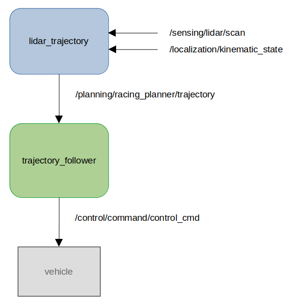

# lidar_trajectory
<!-- Required -->
<!-- Package description -->

This is a packeage for trajectory planning with lidar data only.

## Installation
<!-- Required -->
<!-- Things to consider:
    - How to build package? 
    - Are there any other 3rd party dependencies required? -->

```bash
rosdep install --from-paths src --ignore-src -y
colcon build --symlink-install --cmake-args -DCMAKE_BUILD_TYPE=Release -DCMAKE_EXPORT_COMPILE_COMMANDS=On --packages-up-to lidar_trajectory
```

## Usage
<!-- Required -->
<!-- Things to consider:
    - Launching package. 
    - Exposed API (example service/action call. -->

```bash
ros2 launch lidar_trajectory lidar_trajectory.launch.py
```

## API
<!-- Required -->
<!-- Things to consider:
    - How do you use the package / API? -->

<p align="center">
  
</p>

### Input

| Name         | Type                  | Description  |
| ------------ | --------------------- | ------------ |
| `/sensing/lidar/scan` | sensor_msgs::msg::LaserScan | Data from lidar |
| `/localization/kinematic_state` | nav_msgs::msg::Odometry | Odometry |

### Output

| Name         | Type                  | Description  |
| ------------ | --------------------- | ------------ |
| `/planning/racing_planner/trajectory` | autoware_auto_planning_msgs::msg::trajectory | Planned trajectory |


## References / External links
<!-- Optional -->
Pytohn implementation oh the underlaying algorithm: https://github.com/MikolajZielinski/Lidar-Trajectory-Planner
